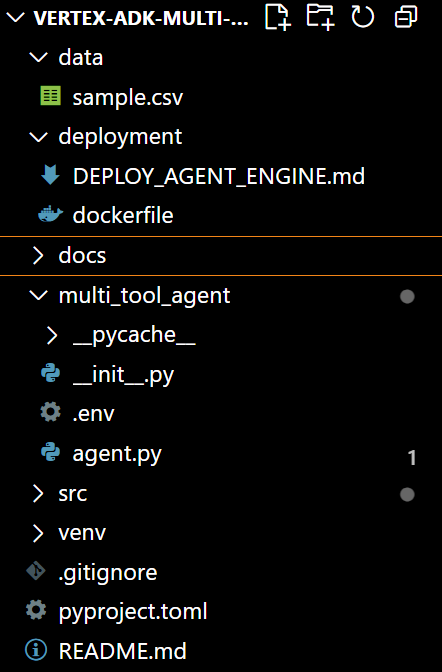
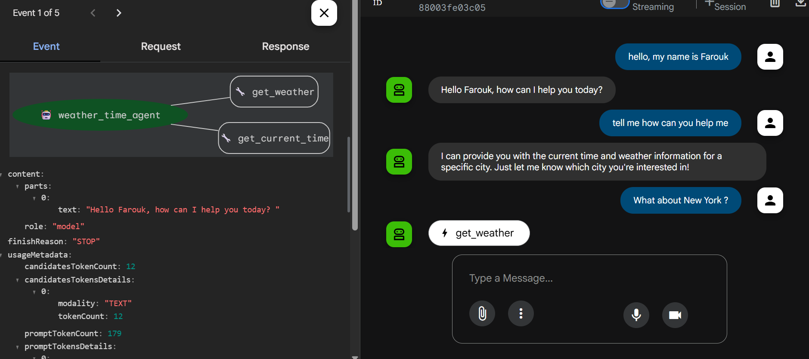
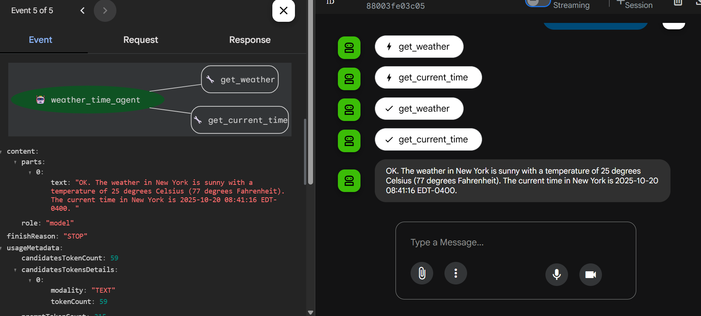
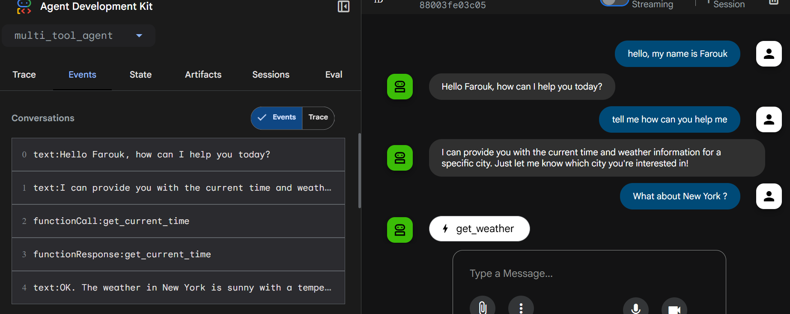
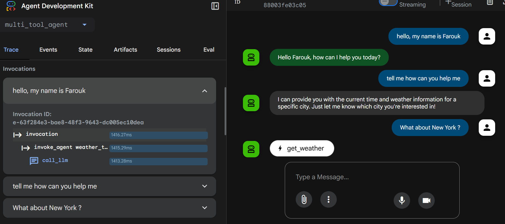
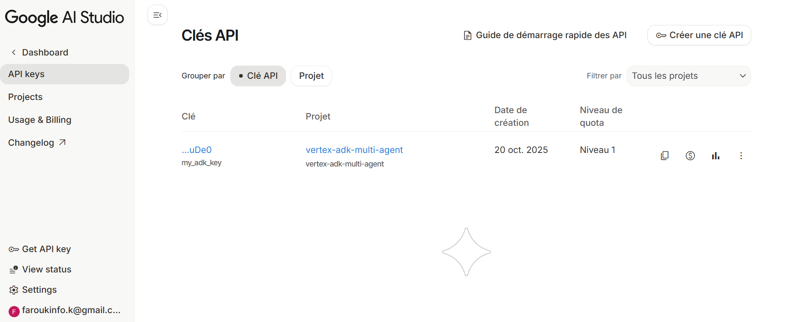
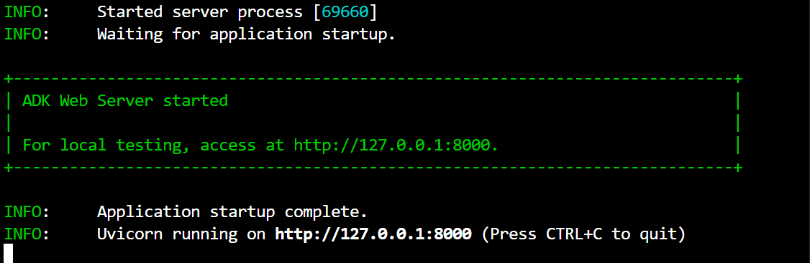

# 🌤️ Vertex AI ADK — Multi-Agent Showcase (Python)

**Author**: [Farouk](mailto:Faroukinfo.k@gmail.com)  
**Tech Stack**: Google Vertex AI · Gemini 2.5 Flash · Python · ADK (Agent Development Kit)

---

## 📘 Description

Ce projet est une **vitrine éducative et technique** du **Google Agent Development Kit (ADK)**, en version Python.  
Il démontre comment :
- Créer un **agent LLM** fonctionnant sur **Vertex AI (Gemini)**,
- Définir des **tools personnalisés** (fonctions Python utilisables par l’agent),
- Lancer et tester l’agent dans l’**interface ADK Web Studio**.

> 🧩 Le projet évoluera vers un système **multi-agent complet** (analyse CSV, résumé d’articles, vérification de code, etc.).

---

## 🏗️ Structure du projet




---

## ⚙️ Installation & Préparation

### 1️⃣ Prérequis
- Python **3.10+**
- Un compte **Google Cloud Platform (GCP)** avec accès à Vertex AI
- L’outil **gcloud CLI** installé et configuré

---

### 2️⃣ Cloner le projet
```bash
git clone https://github.com/<ton-user>/vertex-adk-multi-agent-showcase.git
cd vertex-adk-multi-agent-showcase

python -m venv venv
# Windows PowerShell
.\venv\Scripts\Activate.ps1
# Linux/Mac
source venv/bin/activate

pip install -e .

# install sdk from google if not installed
gcloud auth login
gcloud config set project vertex-adk-multi-agent

gcloud auth application-default login

gcloud services enable aiplatform.googleapis.com

gcloud config list account
gcloud config list project

#.env
# Vertex / ADK
GOOGLE_CLOUD_PROJECT="vertex-adk-multi-agent"
GOOGLE_CLOUD_LOCATION="europe-west1"  # ou autre région
GOOGLE_GENAI_USE_VERTEXAI="TRUE"      # TRUE pour Vertex AI, FALSE pour API key
GOOGLE_API_KEY=""                     # (optionnel si tu utilises Vertex)
# Default model pour tous les LLM Agents
ADK_DEFAULT_MODEL="gemini-2.5-flash"

#Launch adk web
adk web
```












